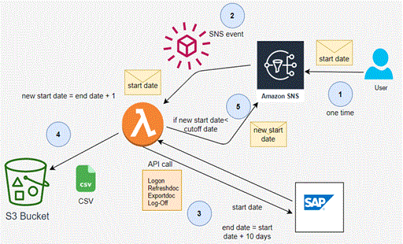

# Data-Ingestion

## SAP Data Ingestion
I have used the following AWS platform services to ingest data from SAP ERP system.

- Lambda for calling SAP API using python
- SNS for triggering the lambda function recursively 
- S3 for storing the CSV files
- VPC and Private Subnet for the lambda 
- IAM role for Lambda which can make call to S3 and SNS

